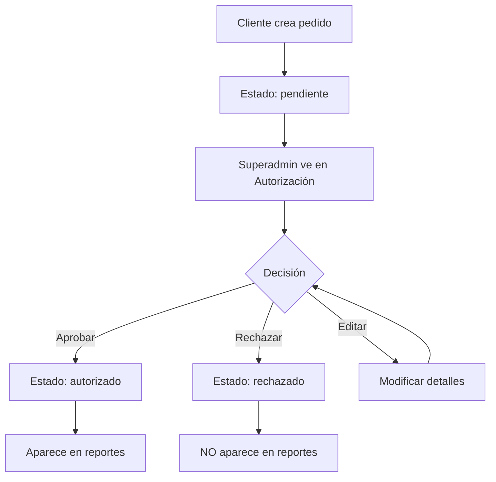

# 🛡️ Módulo de Autorización de Pedidos

## 📋 Descripción

Se ha implementado un nuevo módulo de **Autorización de Pedidos** en el sidebar del sistema, exclusivo para usuarios con rol **Superadmin**. Este módulo permite revisar, aprobar, rechazar y editar pedidos que están en estado "pendiente".

## ✨ Características Implementadas

### 🔐 **Acceso Restringido**
- Solo usuarios con rol `superadmin` pueden acceder
- Verificación automática de permisos al cargar la página
- Redirección automática si no se tienen permisos

### 📊 **Lista de Pedidos Pendientes**
- Muestra todos los pedidos con estado `pendiente`
- Información detallada de cada pedido:
  - Cliente y tier
  - Vendedor asignado
  - Fecha de creación
  - Total del pedido
  - Lista de productos con cantidades
- Ordenados por fecha de creación (más recientes primero)

### 🎯 **Acciones Disponibles**

#### ✅ **Aprobar Pedido**
- Cambia el estado de `pendiente` a `autorizado`
- Modal de confirmación con detalles del pedido
- El pedido aparecerá en los reportes después de la aprobación

#### ❌ **Rechazar Pedido**
- Cambia el estado de `pendiente` a `rechazado`
- Modal de confirmación con detalles del pedido
- El pedido NO aparecerá en los reportes

#### ✏️ **Editar Pedido**
- Navega a la página de pedidos con el pedido específico
- Permite modificar detalles antes de aprobar/rechazar

### 🔔 **Notificaciones en Tiempo Real**
- Contador de pedidos pendientes en el sidebar
- Badge rojo con el número de pedidos pendientes
- Actualización automática cada 30 segundos
- Se oculta cuando no hay pedidos pendientes

### 🎨 **Interfaz de Usuario**
- Diseño consistente con el resto del sistema
- Cards informativos para cada pedido
- Botones de acción claramente diferenciados
- Estados de carga durante las operaciones
- Modales de confirmación para acciones críticas

## 📁 Archivos Creados/Modificados

### 🆕 **Archivos Nuevos**
- `src/pages/Autorizacion.tsx` - Página principal de autorización
- `src/components/autorizacion/ConfirmacionAutorizacion.tsx` - Modal de confirmación
- `src/hooks/usePedidosPendientesCount.ts` - Hook para contador de pedidos pendientes

### 🔄 **Archivos Modificados**
- `src/components/Layout.tsx` - Agregado enlace de Autorización al sidebar
- `src/App.tsx` - Agregada ruta `/autorizacion`

## 🚀 **Cómo Usar**

1. **Acceder al módulo:**
   - Iniciar sesión como Superadmin
   - Hacer clic en "Autorización" en el sidebar
   - El badge rojo indica cuántos pedidos están pendientes

2. **Revisar pedidos:**
   - Ver la lista de pedidos pendientes
   - Revisar detalles del cliente, productos y totales
   - Verificar información del vendedor asignado

3. **Tomar acción:**
   - **Aprobar:** Hacer clic en "Aprobar" → Confirmar en el modal
   - **Rechazar:** Hacer clic en "Rechazar" → Confirmar en el modal
   - **Editar:** Hacer clic en "Editar" para modificar detalles

4. **Seguimiento:**
   - Los pedidos aprobados aparecerán en los reportes
   - Los pedidos rechazados no aparecerán en los reportes
   - El contador se actualiza automáticamente

## 🔧 **Configuración Técnica**

### **Base de Datos**
- Utiliza la tabla `pedidos` existente
- Campo `estado` con valores: `pendiente`, `autorizado`, `rechazado`
- Relaciones con `clientes`, `vendedores`, `items_pedido` y `productos`

### **Hooks Utilizados**
- `useUpdateEstadoPedido()` - Para cambiar estados de pedidos
- `usePedidosPendientesCount()` - Para contador en tiempo real
- `useToast()` - Para notificaciones

### **Servicios**
- `PedidosService.updateEstado()` - Lógica de actualización de estados
- Consultas Supabase con joins para obtener información completa

## 🎯 **Flujo de Trabajo**

## 🔒 **Seguridad**

- **Autenticación:** Verificación de sesión activa
- **Autorización:** Solo Superadmin puede acceder
- **Validación:** Estados válidos según esquema de BD
- **Confirmación:** Modales para acciones críticas
- **Auditoría:** Logs de cambios de estado

## 📈 **Beneficios**

1. **Control Total:** Los Superadmins tienen control completo sobre los pedidos
2. **Trazabilidad:** Historial completo de aprobaciones/rechazos
3. **Eficiencia:** Interfaz intuitiva para procesar pedidos rápidamente
4. **Transparencia:** Información completa antes de tomar decisiones
5. **Flexibilidad:** Posibilidad de editar antes de aprobar

## 🚧 **Mejoras Futuras**

- [ ] Filtros avanzados (por fecha, cliente, vendedor)
- [ ] Búsqueda de pedidos específicos
- [ ] Historial de cambios de estado
- [ ] Notificaciones por email a clientes
- [ ] Exportación de reportes de autorización
- [ ] Modal de edición inline
- [ ] Aprobación masiva de pedidos

